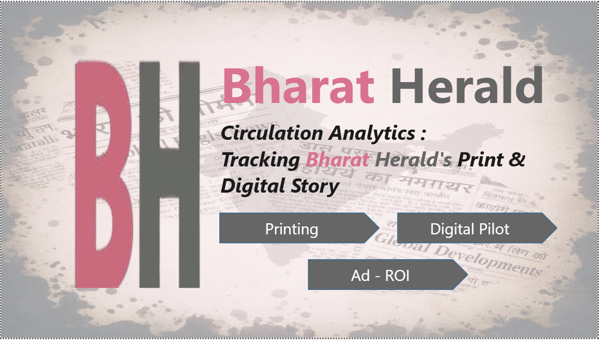
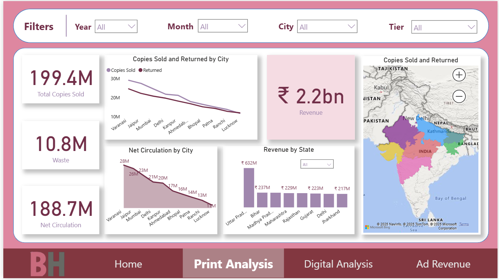
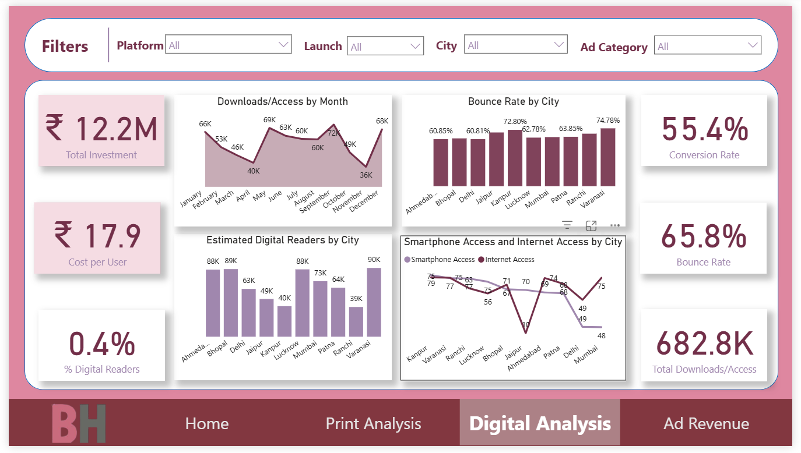
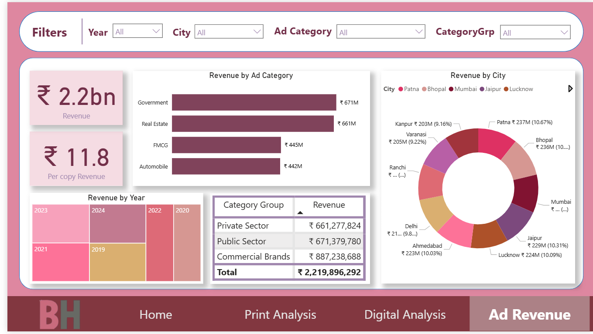

# Bharat Herald Circulation Analytics Dashboard
## Problem Statement
Bharat Herald, a legacy newspaper spread across five Indian states, faces an existential crisis as print circulation dropped steeply from 1.2 million to under 560,000 between 2019 and 2024. The pandemic pushed readers to digital platforms, with competitors adapting quickly. Bharat Herald’s digital pilot failed, resulting in advertiser loss, bureau closures, delayed vendor payments, and major layoffs. This dashboard was created to quantify the decline, diagnose problem areas, and guide a roadmap for digital transformation.

## Data Sources
- fact_ad_revenue.csv: Ad category revenue by city and sector.

- fact_print_sales.csv: Print copies sold, returned, waste, net circulation.

- fact_digital_pilot.csv: E-paper pilot results, downloads, bounce rates.

- fact_city_readiness.csv: City-wise digital readiness indicators. 

- dim_city : City_Id wise City and State indicators. 

- dim_ad_category : Ad_category_id based category_name , category_group and example_companies.

- metadata.txt: Schema and column descriptions.

## Main Visualizations

- Executive summary, project flow (Printing, Digital Pilot, Ad ROI).

- Time trends for print, city/state-wise net circulation, waste, and sales.

- Revenue mapped geographically.

- E-paper downloads by month/city, bounce/conversion rates, cost/user.

- Mobile/internet access and digital user share. 

- Revenue breakdown by ad category, city, and group.

- Key summary metrics: Total revenue, per-copy revenue, city share, and more.

## Technical Details
- DAX measures for revenue standardization, currency conversion, date handling, and conditional formatting.

- Custom calendar table enabling advanced time-based slicing.

- Data cleaned for mixed formats, nulls, and outliers.

- Interactive dashboards with filters for all key variables; slicers for ad category, city, year, platform, etc.

### How to Use
1. Download the PBIX dashboard file from the repository.

2. Open in Power BI Desktop (free).

3. Adjust filters and slicers for custom analysis.

4. Explore separate tabs for Ad Revenue, Print Analysis, and Digital Analysis.

5. Refer to the CSVs and metadata files for data lineage and source information.

## Author
* Tirth Gadhiya
* For feedback, report issues or contact via LinkedIn/GitHub.
